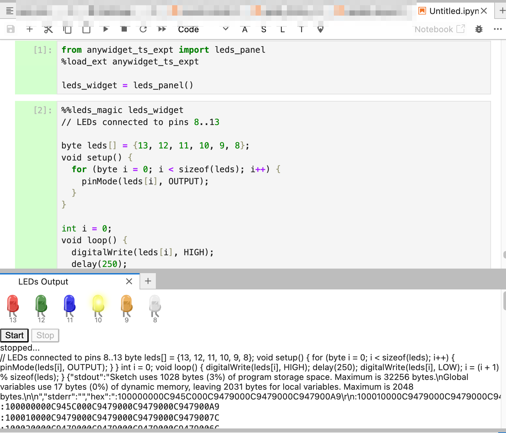

# Notes

To create a custom `anywidget` requires a Python environment and a `node` environment.

*You're on your own installing nodejs. I have a version that seems to work and I'm not going to experiment with trying a new install I can write installation instructions around. Be warned: node often feels like it's trying to download the internet.*

Install the `anywidget` package into a Python environment: `pip install anywidget`

There is a quickstart route to create a new `anywidget` package via `nodejs`. Run the following setup instructions and choose the `ts` option:

> `npm create anywidget@latest`

This will create a minimal set of files and a default directory structure for building an example widget. I used the package name `anywidget_ts_expt` and that will be the default used in the rest of these docs.

Run the following command to install the required `node` packages:

> `npm install`

Run the following command to generate a Javascript bundle from the source Typescript files:

> `npm run build`

Build the python package that can be used to install the `ipywidget` into a Jupyter/IPython environment (may also work in VS Code Python notebook):

> `hatch build`

By default, the package is built into the `./dist/` directory.

Install the Python package from the built package:

> `pip install dist/anywidget_ts_expt-0.0.1.tar.gz`

If you just work with the default generated files, running the following magicds should allow you to experiment with the package as you build and updating it without restarting your python environment (The `env` variable enable "hot module replacement" which is intended to simplify development.)

```python
%load_ext autoreload
%autoreload 2
%env ANYWIDGET_HMR=1
```

In a notebook in the local directory, test the example widget by importing it from the local path (by default, ``):

```python
from src.anywidget_ts_expt import Widget
Widget()
```

You should see a button with a click counter used as the button label.

## Creating an Arduino/`avr8js` simulator widget

Let's see if we can get a demo going using https://stackblitz.com/edit/avr8js-6leds as a crib, and Claude.ai helping with the widget coding.

Several "unofficial demos" are provided for creating "Arduino I/O" enviromments from the [`wokwi/avr8js`](https://github.com/wokwi/avr8js?tab=readme-ov-file#unofficial-examples) repository.

We can crib from these to create simple `anywidget` instantations of the demos.

In *package.json*, modify `scripts.build` to include `--loader:.html=text`  so that we can import our widget HTML as a text string from a file in `leds.ts` (`import html from "./leds.html";`).

Install the `avr8js` package into the node environment, and automatically add it to `package.json` file via the `--save` option`:

`npm install avr8js --save`

We also need to install a custom HTML widgets package:

`npm install @wokwi/elements --save`

Running `npm install` at any time should ensure that required packages are installed if they are ideintified in the `package.json` file.

### Architecture

The architecture for the widget/notebook interaction I'm using is based on the pattern used for [`nbev3devsim`](https://github.com/innovationOUtside/nbev3devsim), a classic notebook widget wrapper for the years old simple `ev3devsim` 2D robot simulator.

Specifically, the widget hosts a simulator for running code that is passed to the widget via IPython magic.

If default settings are used, custom files should be edited in the `./js` directory. Bundled files will be compiled by the `npm run build` file into the `./src/anywidget_ts_expt/static` directory.

The architecture of the widget is based around:

- *an HTML UI*: the HTML template code can be imported from an HTML file as an HTML fragrment;
  - to enable loading of HTML fragments from a file as part of the bundling process, add the following setting to the `scripts.build` command in the `package.json` file: `--loader:.html=text",`;
  - in order that multiple instantiations of a widget within the same notebook or Jupyter environment can be supported, hard-coded HTML `id` values should not be used to baked into the HTML fragment because they will collide with the `id` values of other instances of the same widget.

- a Javascript packahe, compiled/bundled from Typescript that operates within the context of the JupyterLab/Jupyter notebook UI;

- a Python package that operates in the context of the notebook/IPython kernel;

- shared state witn bidrectional comms is supported across variables in kernel's Python environment and in the notebook UI javascript environment. Communication and state synchronisation betweem Python variables and Javascript variables are handled by traitlets.

The Python widget classes should be defined in the `./src/anywidget_ts_expt/__init__.py` directory.

```python

class myWidget(anywidget.AnyWidget):
    # Package dependencies, in this case, custom HTML tag deinfitions
    _deps = ["https://unpkg.com/@wokwi/elements@0.48.3/dist/wokwi-elements.bundle.js"]

    # The path to the root Javascrupt code file for the widget
    _esm = pathlib.Path(__file__).parent / "static" / "mywidget.js"

    # Create a traitlet for each py/js shared state variables
    # There should be matching interfaces in the Typescript code
    code_content = traitlets.Unicode("").tag(sync=True)

    # Also define a helper method on the object
    # to set the self state.
    def set_code_content(self, value):
        self.code_content = value
```

The widget code may be written in a base `mywidget.ts` file. When bundled using the `npm run build` command, this can be loaded into the widget class defined in the `__init__.py` file on the path `pathlib.Path(__file__).parent / "static" / "mywidget.js"`.

Package dependencies can also be bundled into the package from CDNs.

For each traitlet (that is, each Pyhton/Javascript shared state element), a traitlet should be defined in the Python widget class __and__ as an `Interface` in the widget's Typescript file:

```typescript
/* Specifies attributes defined with traitlets in ../src/anywidget_ts_expt/__init__.py */
// In: mywidget.ts

interface WidgetModel {
  code_content: string;
}
```

### Simulator UI

The widget Typescript code should also define a `render()` function:

```typescript
// Type definition for the rendered WidgetModel
import type { RenderContext } from "@anywidget/types";

// HTML fragment defining widget HTML UI
// Ensure the parameter --loader:.html=text is set
// as part of the package.json scripts.build esbuild command
// Ensure you load any dependency files such as
// custom HTML tag definitions as part of 
// the Pyhton widget class defintion
import html from "./widget.html";

function render({ model, el }: RenderContext<WidgetModel>) {
  // Generate an HTML tag containing the widget UI
  let el2 = document.createElement("div");
  el2.innerHTML = html;

  // Append it to the notebook document
  el.appendChild(el2);
}

export default { render };
```

The `model` then provides access to shared state elements:

```typescript
// mywidget.ts code

// Add an observer for the code_content trait
model.on("change:code_content", async () => {
   // Synched state
   const new_value = model.get("code_content")
  });

```

On the Python side, we can read and set state into the widget, as for example with the minimal default generated demo widget:

```python
# Python side
from anywidget_ts_expt import  Widget

# Instantiate a widget
widget = Widget()

# Display the widget at end of a cell
widget

# Get widget value
widget.value

# Set widget value
widget.value = 999
```

Or in the running example:

```python
from anywidget_ts_expt import myWidget

my_widget = myWidget()

# Render the widget
my_widget

# Set state into the widget
my_widget.code_content = "New value"

# Read value from the widget
my_widget.code_content
```

### Passing code to the widget from a magicked code cell

One interaction model I am particularly interested in is using a widget as a "offboard / side processor" for code described in magicked code cell: code is entered into the block magicked cell, the cell is run, the code is handed over to the widget, executed, and the widget HTML UI updated. Widget state may then optionally be read back in *un*magicked cells by reading shared state/traitlet values back from the widget object.

We can define a simple magic to handle this sort of interaction as follows:

- define the magic:

```python
# For example, in ./magics.oy

from IPython.core.magic import Magics, magics_class, cell_magic

@magics_class
class ArduinoMagic(Magics):
    def __init__(self, shell):
        super(ArduinoMagic, self).__init__(shell)

    @cell_magic
    def example_magic(self, line, cell):
        obj_name = line.strip()
        if cell:
            self.shell.user_ns[obj_name].set_code_content(cell)
```

- register the magic

```python
# In __init_.py

from .magics import ArduinoMagic

def load_ipython_extension(ipython):
    ipython.register_magics(ArduinoMagic)

We can then load in the magic from the package as:

`%load_ext anywidget_ts_expt`

And call the magic by passing the variable name of the instantiated as an argument in a block magic of the form:

`%%example_magic my_widget`

The code in the magicked cell will then be passed into the widget.


### Displaying the widget in its own panel

If we are using a widget to "offboard" processing and then display the results of exucting that code within the widget context, it can be convenient to have the widget displayed in its own panel. The [`jupyterlab-sidecar`](https://github.com/jupyter-widgets/jupyterlab-sidecar) extension provides one way of launching a widget into its own panel.

For example, if we add a function of the following form to our Python package:

```python
from sidecar import Sidecar

def widget_panel(title="LEDs Output", anchor="split-bottom"):
    sc = Sidecar(title=title, anchor=anchor)

    widget_ = myWidget()
    with sc:
        display(widget_)

    return widget_
```

we can then launch a widget into its own panel, as well as getting a handle onto the widget object, in the following way:

```python
from anywidget_ts_expt import widget_panel

mywidget = widget_panel()
```



Load in the packages, create a widget in its own panel, run the magicked cell to get the code into the widget, click the run button to execute the code in the widget.
