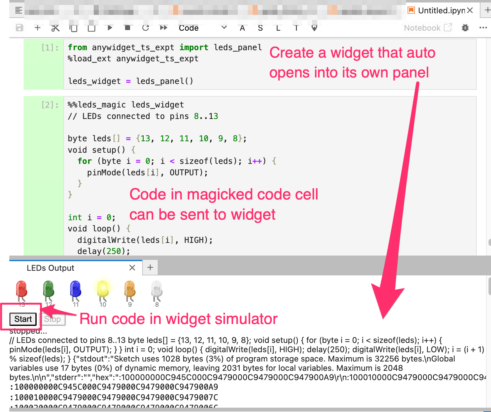

# anywidget_ts_expt

Simple experiments to explore the use of [`anywidget`](https://anywidget.dev/) to create a simple IPython widget to wrap a Typescript based application, such as an Arduino simulator ([`avr8js`](https://github.com/wokwi/avr8js)).

Code is sent from a magicked cell to an isolated ipywidget running (via [`jupyterlab-sidecar`](https://github.com/jupyter-widgets/jupyterlab-sidecar)) in its own panel.

See [`NOTES.md`](./NOTES.md) for a walkthrough on creating `anywidget` widgets to create an `ipywidget` wrapper around a simple Typescript application (`avr8js`).



Example:

```python
%pip install https://github.com/ouseful-testing/anywidget-ts-expt/raw/main/dist/anywidget_ts_expt-0.0.1-py2.py3-none-any.whl
```

```python
from anywidget_ts_expt import leds_panel
%load_ext anywidget_ts_expt

leds_widget = leds_panel()
```

```python
%%leds_magic leds_widget
// LEDs connected to pins 8..13

byte leds[] = {13, 12, 11, 10, 9, 8};
void setup() {
  for (byte i = 0; i < sizeof(leds); i++) {
    pinMode(leds[i], OUTPUT);
  }
}

int i = 0;
void loop() {
  digitalWrite(leds[i], HIGH);
  delay(250);
  digitalWrite(leds[i], LOW);
  i = (i + 1) % sizeof(leds);
}
```

## Original Code

- `avr8js`: Copyright (C) 2019-2023 Uri Shaked, MIT License, https://github.com/wokwi/avr8js
- `anywidget`: Copyright (c) 2022-2024 Trevor Manz, MIT License, https://github.com/manzt/anywidget