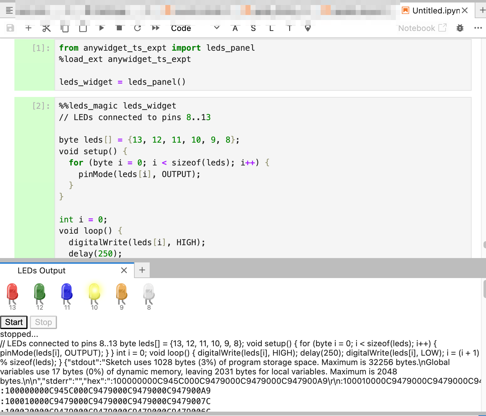

# anywidget_ts_expt

Simple experiements to explore the use of [`anywidget`](https://anywidget.dev/) to create a simple IPython widget to wrap a Typescript based Arduino simulator ([`avr8js`](https://github.com/wokwi/avr8js)).

See [`NOTES.md`](./NOTES.md) for a walkthrough on creating `anywidget` widgets to create an `ipywidget` wrapper around a simple Typescript application (`avr8js`).

